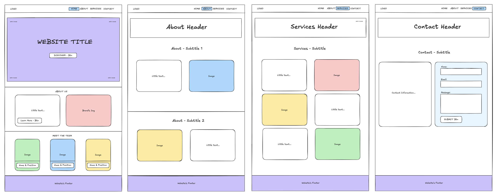

# AnyKindaPeople - Responsive Band Website

A modern, fully responsive multi-page website for the South London R&B/Neo-Soul band "Any Kinda People". Built with pure HTML and CSS, showcasing modern web development techniques.
- **🌎 Live Demo** - [View the live site here!](https://davidadam1323.github.io/anykindapeople-website/)

### Key Features

- **Fully Responsive Design** - Adapts seamlessly to desktop, tablet, and mobile devices
- **Modern Flexbox Layouts** - Clean, organized structure using CSS Flexbox
- **Multi-page Navigation** - Home, About, Artists, and Contact pages
- **Interactive Elements** - Hover effects, transitions, and animations
- **Styled Contact Form** - Professional contact form with validation
- **CSS Variables** - Consistent theming across the entire site
- **Accessible Design** - Semantic HTML and proper ARIA labels

<h1 align="start">Planning & Design Process</h1>

  

📋 During the planning phase, I created a wireframes to establish the layout and structure for each page before diving into development.

## Pages Overview

### Home Page
- Hero section with band introduction
- Band vision and mission statement
- Meet the band member cards with hover effects
- Responsive grid layout

### About Page
- Band story and background
- Musical influences and sound description
- Upcoming and recent live shows
- Interactive show listings

### Artists Page
- Detailed band member profiles
- Individual bios and musical influences
- Instrument-specific information
- Professional photography

### Contact Page
- Styled contact form with validation
- Band contact information
- Social media links
- Professional layout with contact image

## Technologies Used

- **HTML5** - Semantic markup and structure
- **CSS3** - Advanced styling and animations
- **Flexbox** - Modern layout techniques
- **CSS Variables** - Consistent theming
- **Google Fonts** - Custom typography (Limelight)
- **Font Awesome** - Icons and visual elements
- **Media Queries** - Responsive design

⚠️ **Current Status:** The contact form is currently frontend-only and doesn't send messages yet. I'm working on adding backend functionality soon!

## Want to Connect?

I am always up for a good chat about projects, collaborations, or geeking out over code (and guitars!). Drop me a message on [**LinkedIn**](https://www.linkedin.com/in/davidadamsilva/)!

  

    "This website marks my second challenge in the Step8up Bootcamp; another exciting step in my web development journey."
  

